# Naruhodo!


Mercari hackathon 2018 prototype

https://b-z.github.io/naruhodo

***

### What is this?

**Naruhodo!** means "I see!" or "Aha moment" in Japanese.

This application is designed for students, using AR technology to help them do some wonderful scientific experiments at home.

Currently, it provides a simple optical experiment for demonstration. Users are free to use lenses, mirrors, etc. in it.

### Why do you do this?

Education is the foundation of a country. **Equal and quality education** is very important. The imbalance of educational resources is a common problem between China and Japan. In a top school, students receive the best education and can do research in the laboratory, which is not possible for students in other schools.

I was born in a poor city. In my student days, I enjoyed to do interesting scientific experiments at home. For example, give me a copper wire (Cu), I will heat it on the fire to get copper oxide (CuO), then put the copper oxide into vinegar (CH~3~COOH), I will finally get a beautiful blue copper acetate (Cu(CH~3~COO)~2~) solution. But a serious problem is that my home cannot always provide the right experiment tools. And it is not safe to do some experiments at home.

AR ([Augmented Reality](https://en.wikipedia.org/wiki/Augmented_reality)) is a new technology which can mix the real world and the virtual world. I hope to use this technology to help students who are interested in science, to do interesting experiments at home.

### How can I play with it?

First, you should print some markers:

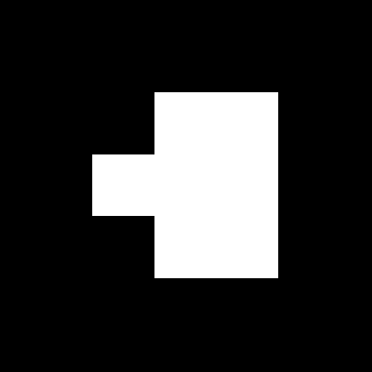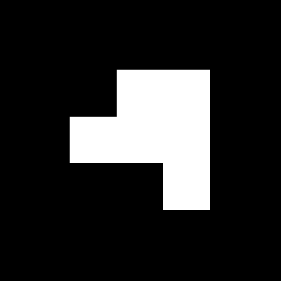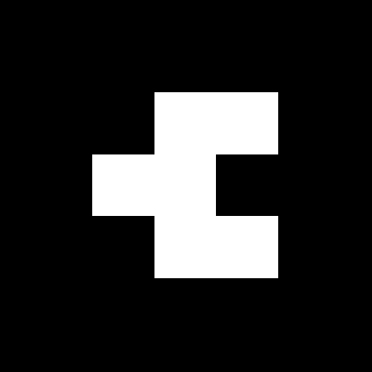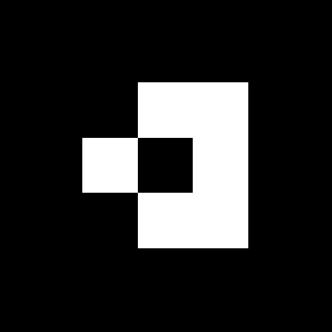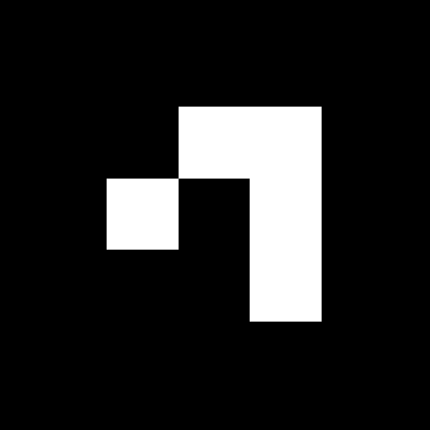

The first two together constitute a light source, and the latter four markers are convex lens, concave lens, spherical mirror and plane mirror, respectively.

Place these markers on your desk and play!

### How does it work?

Currently, the core of **Naruhodo!** is designed as a three-layer structure:

*   Layer-3 is the basic layer. It captures video through the camera of the user's device. `AR.js` analyzes the position and orientation of the markers relative to the camera from the video stream.
*   Layer-2 is the logical layer. In this layer, the light source and other optical instruments are generated from the markers, and the result of the interaction of the light with the optical instruments is calculated.
*   And Layer-1 is the visualization layer. It uses `three.js` to render the calculated models on the web page.

Here, Ar.js and three.js are two famous open-source libraries. They provide basic AR and model rendering capabilities, respectively. Since they only provide very basic APIs, I still have a lot of work to do. For example, to make the detection more robust in Layer-3, and to generate 3D models and light sources in Layer-1.

### How can I deploy?

*   **Naruhodo!** should be visited through an `https` website, otherwise it has no permission to open the camera of your iOS device.

*   To set-up a simple https server, you can do this:

   ```bash
   npm install -g http-server
   openssl req -newkey rsa:2048 -new -nodes -x509 -days 3650 -keyout key.pem -out cert.pem
   http-server -S -C cert.pem -o -c-1
   ```

* Then, open https://localhost:8080.

### Advantages

*   No special experiment tools are required. All you need to prepare is a phone (or tablet) and some markers.
*   You can see the light path. Even in laboratory, it is hard to visualize the light path in an optical experiment.
*   You can adjust the parameters of every experiment equipment. For example, the focal length of a lens.
*   It combines the virtual and reality, so that you can feel the scale of each object in reality.

### Disadvantages

*   Simulating the glass material of the lens as realistically as possible will make the display look better, but on a web page, computing resources are not enough to achieve such a function.

### Your inspiration?

My inspiration comes from Nintendo LABO and teamLab:star: 's exhibitions. I think an educational application should not be limited to virtual, but should be combined with the reality.

| 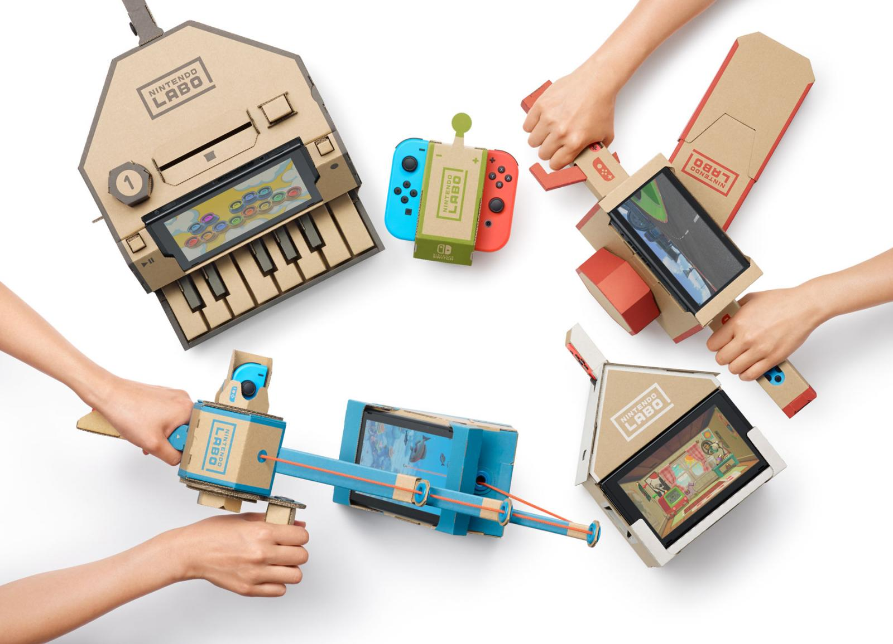 | 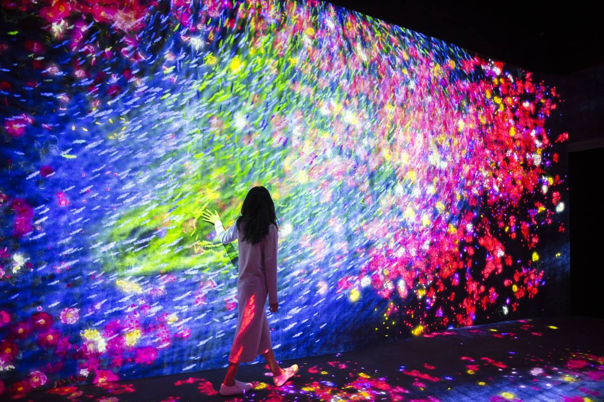 |
| :-----------------------: | :------------------------------: |
|       Nintendo LABO       |          teamLab:star:           |

### What will you do next?

*   Make it work better.
*   Design a simple game about it.

***

### 光线与光学器件求交

**和凸透镜、凹透镜、球面镜求交均可以看成和球面镜求交**

分两步:

1.  和球面镜所在的球求交
2.  判断交点合法性

假设光线由$(x_0, y_0, z_0)$射出，方向为$(a, b, c)$，那么光线可以表示为

$$(x_0, y_0, z_0) + t(a, b, c), t>\varepsilon$$，

假设球是$(x-x_b)^2+(y-y_b)^2+(z-z_b)^2=R^2$，那么相交时有

$$(x_0+ta-x_b)^2+(y_0+tb-y_b)^2+(z_0+tc-z_b)^2=R^2$$，

得到关于$t$的二次方程:

$$(a^2+b^2+c^2)t^2+\\2(a(x_0-x_b)+b(y_0-y_b)+c(z_0-z_b))t+\\((x_0-x_b)^2+(y_0-y_b)^2+(z_0-z_b)^2-R^2)=0$$

可由此解出$t$，并进一步得到交点。判断交点合法性可以求交点到镜面中心的距离是否在合法范围。

**和平面镜求交**

平面镜的空间表示是一个中心点c加上x、y方向两个正交向量的线性组合，也就是说，

$$src+t\cdot dir=c+a\cdot x+b\cdot y$$

满足$-1\le a\le 1$，$-1\le b\le 1$，$t>\varepsilon$。

其中$a$、$b$、$t$是标量的未知数，其他向量可以挪到等号一边，变成三元一次方程，对三阶矩阵求逆即可。

### 光线投射

首先对所有元件求交，在所有交点中取最近的。

然后针对不同元件做进一步处理:

*   镜面: 找到交点、按此处法线反射
*   透镜: 找到交点、法线，按折射公式折射，需要处理全反射的情况

如果经过元件变换进一步生成了新的光线，那么继续投射这根新的光线。

### 关卡设计

*   用平面镜等，将平行光源反射到旁边某个指定的圈里


*   平行光->凸透镜->凹透镜->变成很细的一束平行光，经过平面镜反射到目标，目标check这束光是否足够细且平行

### Note

*   模型在Three.js的scene里是这样组织的: 每个marker是scene的子节点，是一个group对象，可以给这个group添加子节点。当现实世界的marker移动之后，这个marker group的坐标会发生变化，从而子节点也会发生变化。
*   几何光学实验:
    *   平行光源、点光源、凸透镜、凹透镜、凸面镜、凹面镜
    *   光源由两个marker确定方向，可以射出很多光线
*   单缝衍射、双缝干涉实验:
    *   线光源、可调的双缝。不需要接收屏，因为接收屏的位置不影响观察结果，可由双缝位置确定。
    *   只有一个缝的时候，实验变成单缝实验。
    *   需要在接收屏上方增加亮度曲线。
*   优势:
    *   无需专门的实验器材
    *   可以观察到光路
    *   可以自由调整各个器材的光学参数
    *   与现实结合，可体会到对象实际尺度

### To-do list

* [ ] ~~@bug: 有时候识别marker会上下颠倒。对于单一的marker，这个是无解的，两种方向在现实中都可以解释通。感觉只能强行靠其他marker规定方向。~~
* [x] 对每个光学元件，使用两个marker确保可靠?
      * [x] 插值光源位置
      * [ ] ~~插值其他器件~~
* [ ] ~~增加一个双缝干涉实验?~~
* [ ] 做得尽量像教科书的
* [ ] 在marker旁边标注一些图、文字
* [x] @bug: 反射光线从反射点射出来的时候会和镜面本身有交点，需要将这个点排除(交点距离光源长度应大于$\varepsilon$)
* [ ] 使用mathjax显示相关公式
* [x] 允许设置光线数量
* [x] 允许设置光线发散程度
* [x] 注意一下控制台冒出来的警告⚠️?
      *  是因为光线从玻璃射出的时候发生了全反射，导致折射公式求解失败
* [ ] 对渲染使用后处理，看起来更酷炫点
* [ ] 在修改元件参数时，在AR场景中绘制相关辅助信息
* [ ] 加入游戏关卡设置
* [x] 调整元件参数时，动态改变mesh的形状
* [x] 支持多种颜色的光线
      * [ ] ~~是否要做渐变的光线? 比如opacity越来越高~~
* [x] 增加平面镜
* [x] ~~不显示透镜内部的光线，以加速~~
* [x] 与光学元件求交之后，对所有潜在交点排序
* [ ] 去除双缝实验，改为自由模式与游戏模式
* [ ] 增加音效
* [x] 做成积木块
* [x] 元件换个颜色，现在丑爆了，弄一个这种材质? https://www.etsy.com/jp/listing/627682478/detroit-become-human-cyberlife-tote-bag?ref=shop_home_active_5
* [ ] 凹透镜外围封起来
* [ ] 强制让所有marker共面!
* [x] 调整元件参数，改为调整焦距，并在上面标出球半径，与长度单位

### Development log

*   9.1
    *   确定使用AR做桌上实验模拟
    *   调研AR的开源工具，确定可行性
*   9.2
    *   建立github仓库
    *   打印各种marker
    *   尝试marker识别的demo
*   9.3
    *   支持使用barcode
    *   支持使用多个marker
    *   增加截图功能
    *   增加grid的绘制
*   9.4
    *   绘制光线、同步光线坐标系与marker坐标系
    *   加入UI
*   9.5
    *   修复手机浏览器上UI不正常的问题(非常坑)
    *   画了个icon
    *   美化UI
    *   添加球面镜元件，但有bug
*   9.6
    *   修复反射光线抖动的bug
    *   支持自定义参数
        *   球面镜的球半径
        *   点光源/平行光源
        *   光源光线数量
        *   点光源发散度
    *   光源使用双marker，插值增加稳定性，缺失一个也可以工作
    *   实现凸透镜
*   9.7
    *   修复全反射导致的bug
    *   显示凸透镜、球面镜的mesh
    *   支持动态调整mesh的参数
    *   光源由"球体"修改成"圆周"的
    *   美化封面
*   9.8
    *   支持透明材质
*   9.9
    *   支持凹透镜
*   9.10
    *   支持平面镜
    *   支持不同颜色的光
    *   更换了一种显示的材质
*   9.11
    *   调整半径改为调整焦距，球半径会自动根据焦距计算
    *   平均各个marker坐标系的位置及朝向

### Gallery

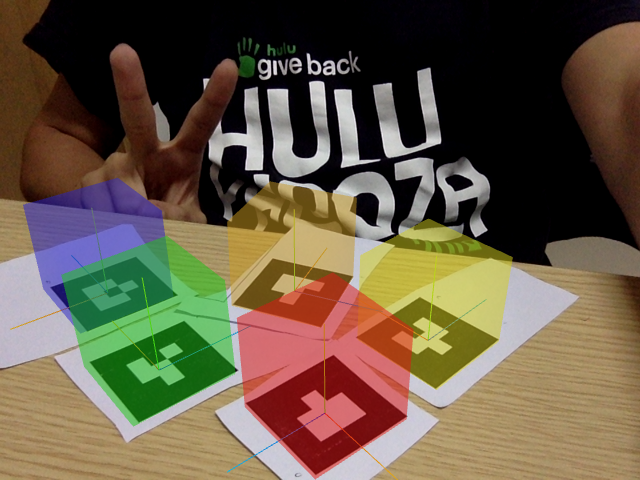

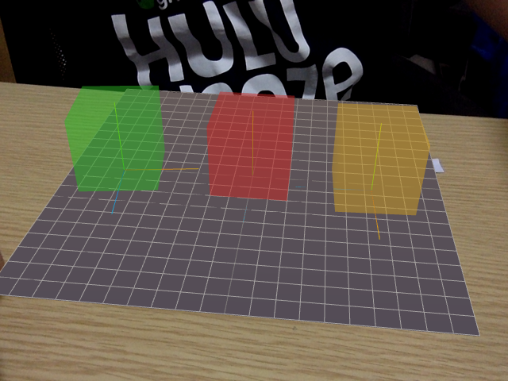

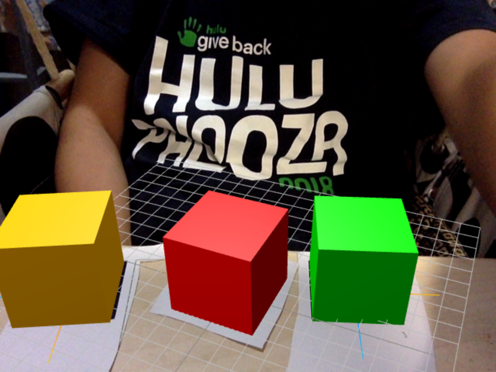

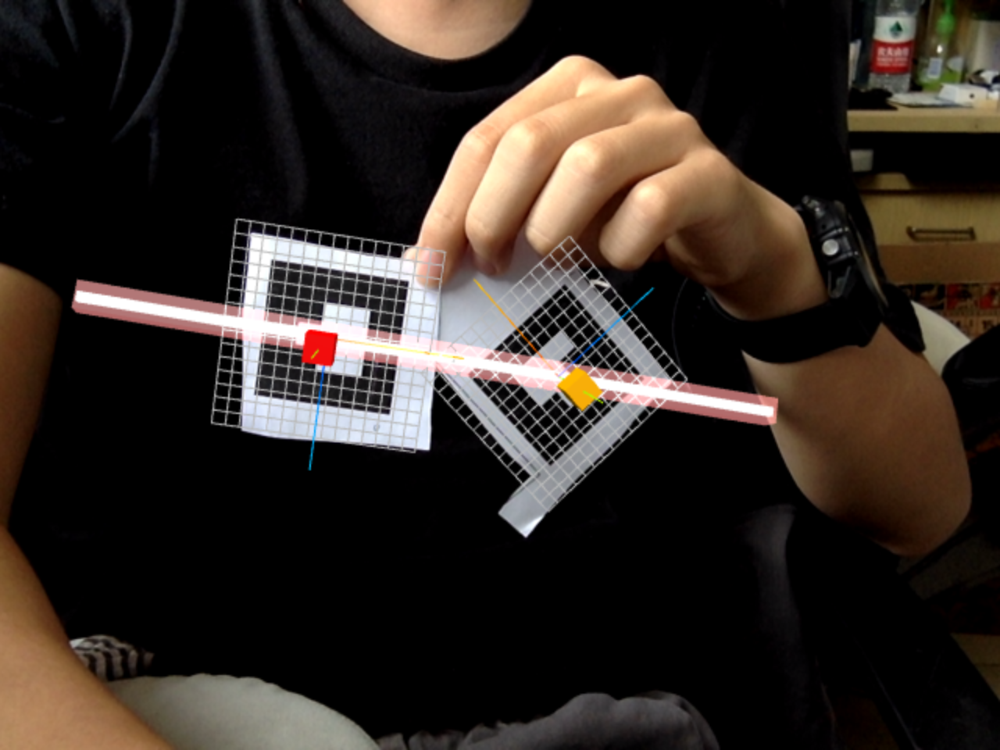


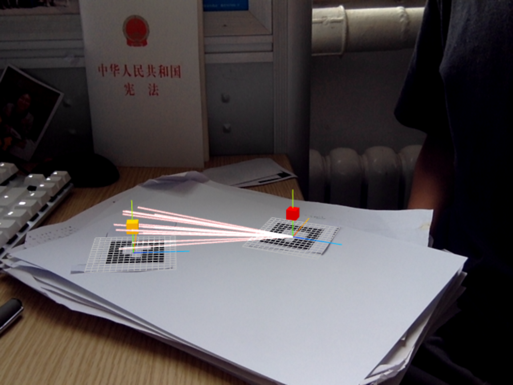

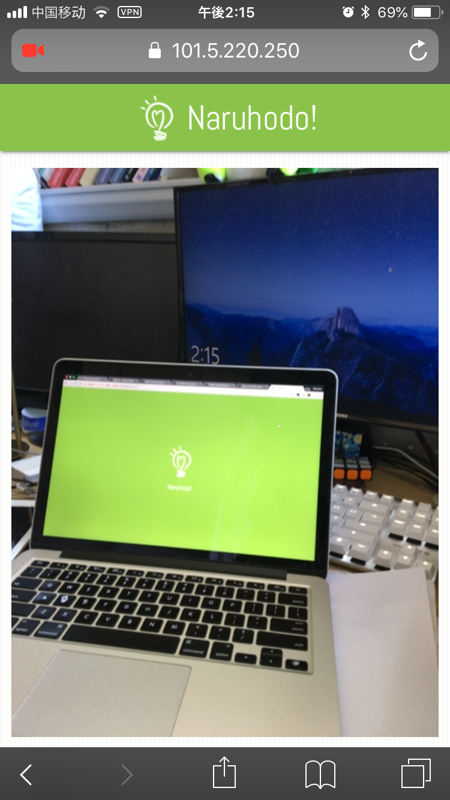

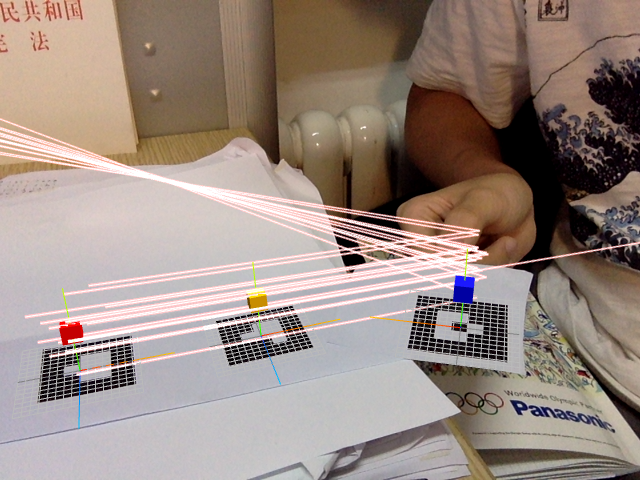

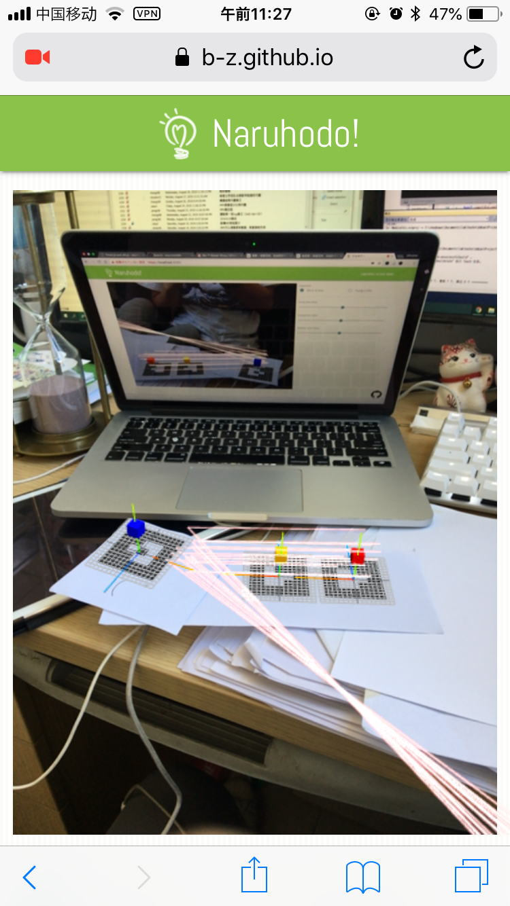

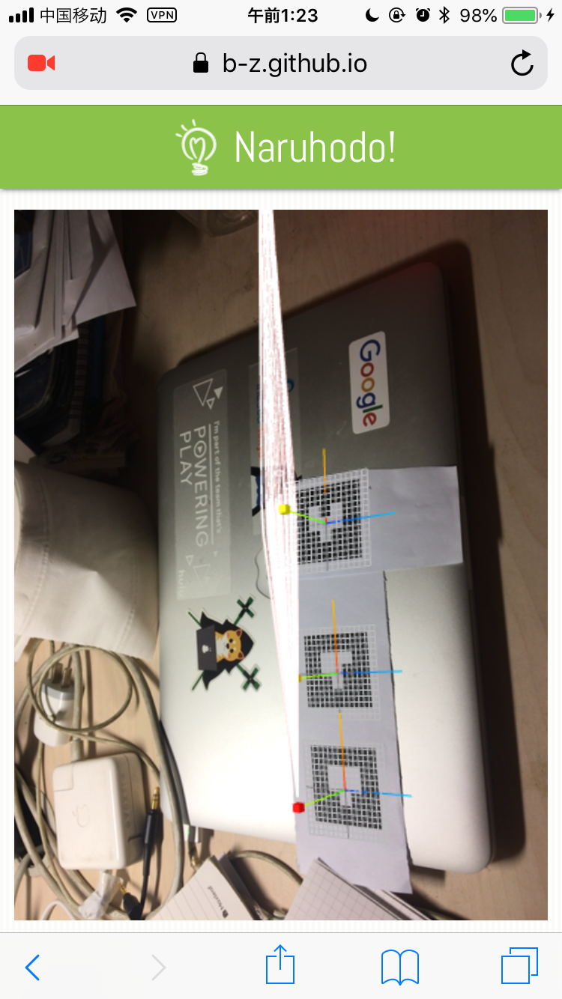

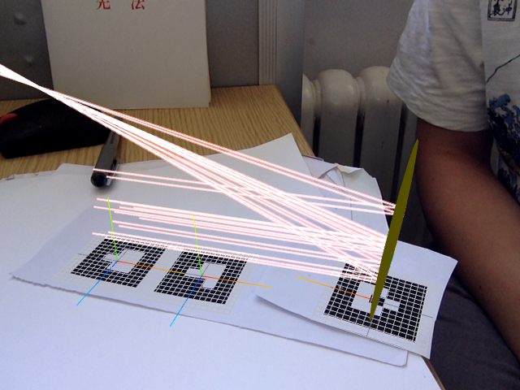

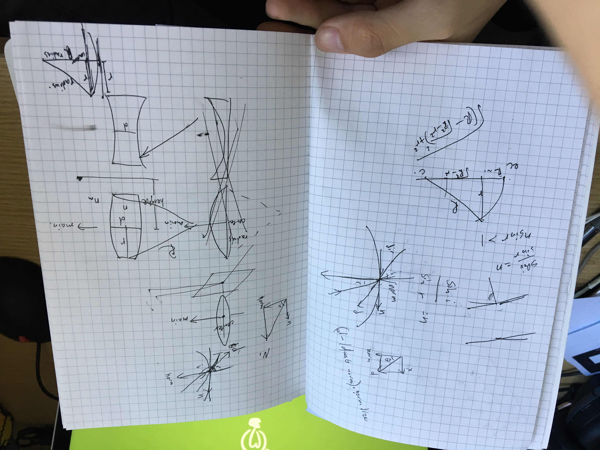

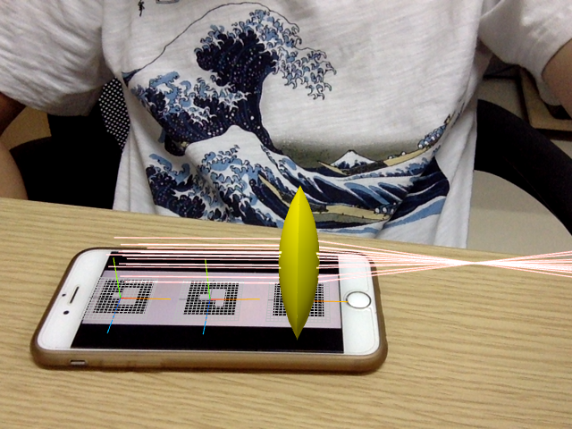

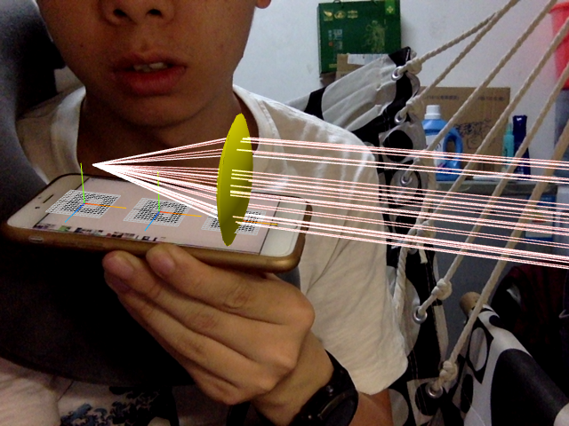

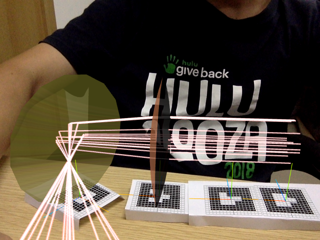

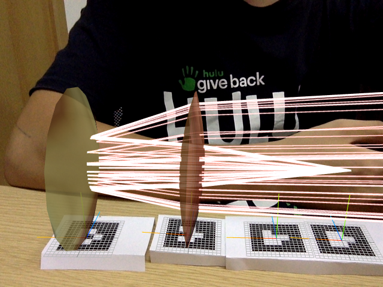

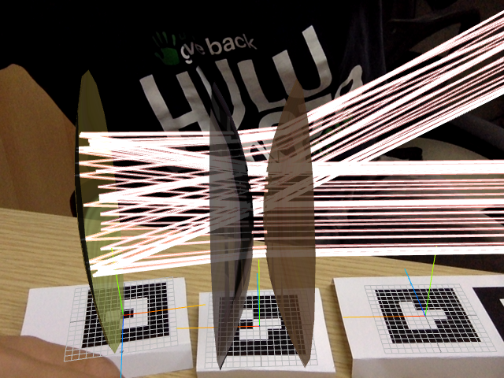

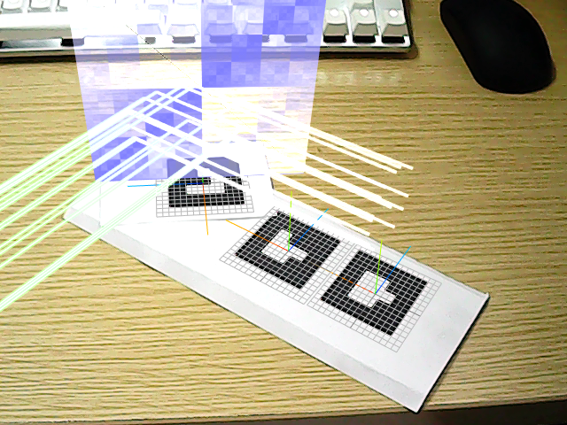

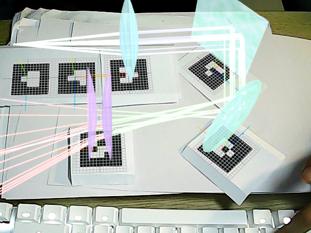